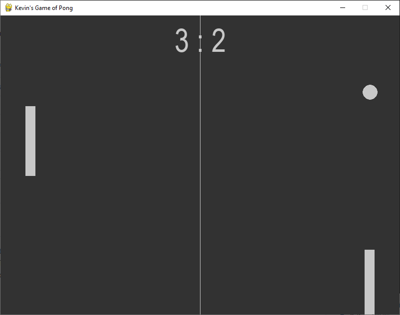

# Pong Game

This is a simplified version of the classic Pong game using Python and Pygame. The game features two paddles, a ball, and a simple scoring system. The objective of the game is to hit the ball with the paddle and score points by getting the ball past the opponent's paddle.



## Installation

1. Install Python 3.6 or later on your system.
2. Clone or download this repository to your local machine.
3. Install the Pygame library by running the following command in your terminal:
    ```
    pip install pygame
    ```

## Usage

1. Navigate to the project directory in your terminal.
2. Run the following command to start the game:
    ```
    python main.py
    ```
3. Use the `W` and `S` keys to move the left paddle up and down, respectively.
4. Use the `Up` and `Down` arrow keys to move the right paddle up and down, respectively.
5. Play the game and try to score points by getting the ball past the opponent's paddle.

## Customization

You can customize various aspects of the game by editing the values in the `settings.py` file. For example, you can change the screen size, ball speed, paddle speed, font style, and sound effects. 

## Contributing

If you find any problems with the game, please feel free to open an issue or submit a pull request. 

## Credits

Kevin wrote this game while learning the Pygame package for Python. 
